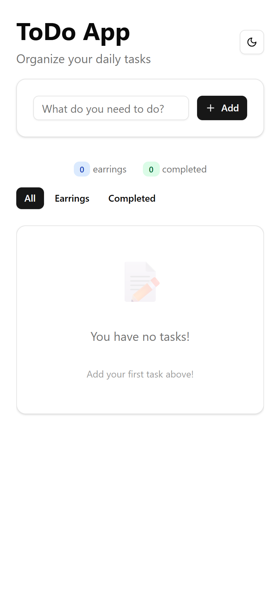

# Vue.js & Vite ToDo App

This is a simple yet powerful ToDo list application, developed with Vue.js 3 (Composition API) and Vite. It allows users to manage their daily tasks in a clean, efficient, and visually pleasing way, featuring modern functionalities like data persistence and theme switching.



## ✨ Key Features

The application includes a comprehensive set of features for effective task management:

*   **Task Management:**
    *   **Add Tasks:** Quickly create new tasks from the main input field.
    *   **Edit Tasks:** Modify the text of an existing task by clicking the edit icon.
    *   **Mark as Complete:** Toggle a task's status (pending/completed) using the checkbox. The task's visual style changes to reflect its status.
    *   **Delete Tasks:** Remove individual tasks with a single click.

*   **Display & Filtering:**
    *   **Dynamic Filters:** View all tasks, only **active** ones (*labeled 'Earrings' in the code*), or only **completed** ones.
    *   **Task Counters:** See at a glance how many tasks are pending and how many have been completed.

*   **Data Persistence:**
    *   **Local Storage:** Your tasks are saved in the browser's `localStorage`, so you won't lose them when you reload the page or close the browser.

*   **User Interface (UI):**
    *   **Light & Dark Mode:** Switch between light and dark themes for visual comfort. Your preference is saved and syncs with your system's OS setting on the first visit.
    *   **Responsive Design:** The application adapts to different screen sizes, from mobile to desktop.
    *   **Smart Empty States:** Displays helpful messages when there are no tasks to show based on the selected filter.
    *   **Clean Interface:** Built with `shadcn-vue` components and `Tailwind CSS` for a modern and consistent look.

## 🛠️ Tech Stack

*   **Framework:** [Vue.js 3](https://vuejs.org/) (using Composition API & `<script setup>`)
*   **Build Tool:** [Vite](https://vitejs.dev/)
*   **Styling:** [Tailwind CSS](https://tailwindcss.com/)
*   **UI Components:** [shadcn-vue](https://www.shadcn-vue.com/)
*   **Icons:** [Lucide Icons](https://lucide.dev/)

## 🚀 Getting Started

Follow these steps to get a local copy of the project up and running.

### Prerequisites

Make sure you have [Node.js](https://nodejs.org/) installed on your machine (version 18 or higher is recommended).

### Installation

1.  **Clone the repository** to your local machine:
    ```bash
    git clone https://YOUR-REPOSITORY-URL.git
    ```

2.  **Navigate to the project directory**:
    ```bash
    cd your-project-directory-name
    ```

3.  **Install the project dependencies** using npm (or your preferred package manager):
    ```bash
    npm install
    ```

4.  **Start the development server**:
    ```bash
    npm run dev
    ```

5.  You're all set! Open your browser and visit `http://localhost:5173` (or the URL shown in your console) to see the application in action.

## 📦 Available Scripts

In the project directory, you can run the following commands:

*   `npm run dev`: Runs the app in development mode with hot-reloading.
*   `npm run build`: Builds the app for production to the `dist` folder.
*   `npm run preview`: Locally serves the production build for previewing.